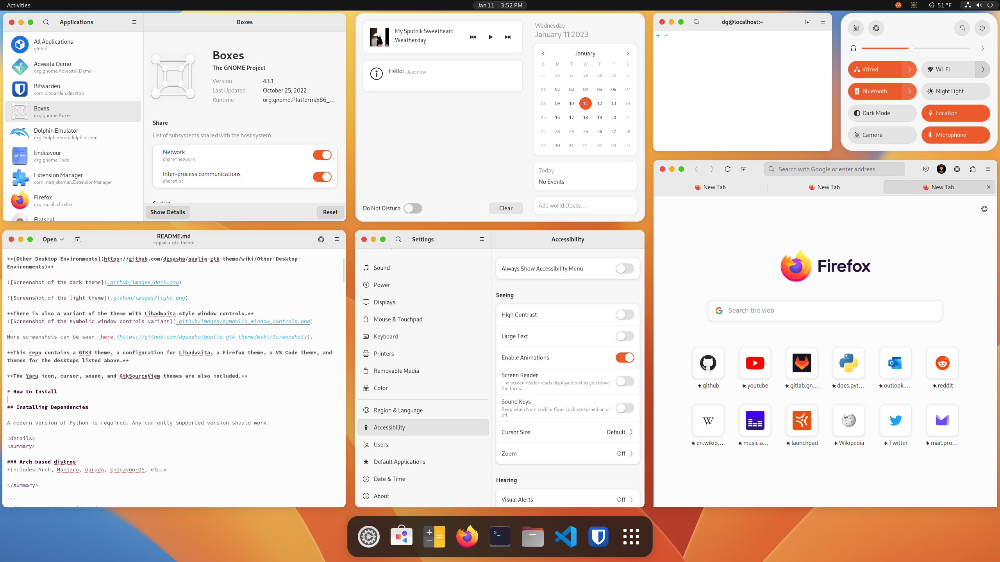

<div align="center">

# dg GNOME Theme
**A Yaru inspired theme designed to provide a consistent experience on GNOME 42+**

*Other desktops should work, see [this section](#other-desktop-environments) for more information.*




**This repo contains a GTK3 theme, a configuration for Libadwaita, a Firefox theme, and a GNOME Shell theme. The Yaru icon, cursor, sound, and GtkSourceView themes are also included.**

# How to Install

</div>

## Installing Dependencies

- Arch based distros: `sudo pacman -S sassc git gnome-shell-extensions ninja meson`

- Debian based distros: `sudo apt install sassc git gnome-shell-extensions ninja-build meson`

- Fedora: `sudo dnf install sassc git gnome-shell-extension-user-theme ninja-build meson`

- openSUSE: `sudo zypper install sassc git gnome-shell-extension-user-theme ninja meson`

**If `gnome-shell-extensions` / `gnome-shell-extension-user-theme` wasn't already installed, log out and log back in before you proceed. If you aren't using GNOME or aren't going to install the GNOME Shell theme, you can skip installing it.**

## Downloading and Installing
Download the repository and run the install script with no options to configure and install the theme.

When configuring the theme you get to choose an [accent color](#available-accent-colors), choose between the [light and dark variants](#light-and-dark-variants), and choose which themes you want to install.
```
git clone https://github.com/dgsasha/dg-gnome-theme -b main && cd dg-gnome-theme
```
```
./install.sh
```
```
Usage: ./install.sh [OPTION]...

OPTIONS:
  -r, --reconfigure   Reconfigure the theme.
  -f, --force         Force reinstall the theme.
  -c, --clean         Clean build directories and exit.
  -v, --verbose       Show full meson output.
  -h, --help          Show this screen.

This script allows you to configure, install, and update the theme.
```

#### Available Accent Colors:


### Light and Dark Variants
The themes won't automatically update if you change the light/dark theme preference in GNOME. It is recommended to set the theme to `auto` during configuration, so when you change the light/dark theme preference in GNOME you can just run `./install.sh` afterwards to update the themes using the new preference.

## Updating
The install script will handle updating the themes.
```
git pull
```
```
./install.sh
```

Your previous configuration will be used again unless you use the `--reconfigure` option.

Only the themes that have changes will be updated, if you want to reinstall all of the themes, use the `--force` option.

## Uninstalling
Before uninstalling, use GNOME Tweaks to change the themes to something else to avoid any issues. 

After doing that, run the uninstall script:
```
./uninstall.sh
```
```
Usage: ./uninstall.sh [OPTION]...

OPTIONS:
  -f, --firefox [standard|flatpak|snap]
        Uninstall dg-firefox-theme.
        Using no arguments will remove all variants.
  -g, --gnome-shell
        Uninstall dg-yaru GNOME Shell theme.
  -i, --icons
        Uninstall dg-yaru icon theme.
  -c, --cursors
        Uninstall dg-yaru cursor theme.
  -s, --sounds
        Uninstall dg-yaru sound theme.
  -v, --gtksourceview
        Uninstall dg-yaru GtkSourceView theme.
      --gtk3
        Uninstall dg-adw-gtk3.
      --gtk4
        Uninstall dg-libadwaita.
      --snap
        Uninstall dg-adw-gtk3-theme Snap.
  -h, --help
        Show this screen.

Run './uninstall.sh' with any number of the above options to choose which parts of the theme to uninstall."
Or run './uninstall.sh' with no arguments to uninstall the entire theme."
```

## Flatpak Apps
Run this command once to let all Flatpak apps access the themes:
```
flatpak override --user --filesystem=xdg-config/gtk-4.0 --filesystem=xdg-data/themes
```

## Snap Apps
If Snap is installed you can enable Snap support when configuring the theme.

If you really want Snaps to access the GTK4/Libadwaita configuration, you will have to run this command for each Snap, replacing `SNAP-NAME` with the name of the Snap:
```
sudo mount --bind --mkdir ~/.config/gtk-4.0 ~/snap/SNAP-NAME/current/.config/gtk-4.0
```
For this to persist after reboot, you need to add the following line to /etc/fstab. Replace `USERNAME` and `SNAP-NAME` with the correct information.
```
/home/USERNAME/.config/gtk-4.0  /home/USERNAME/snap/SNAP-NAME/current/.config/gtk-4.0  none  bind  0  0
```

## GDM Theme
I recommend using [Login Manager Settings](https://github.com/realmazharhussain/gdm-settings) to change the GDM theme to dg-yaru.

If you change the GDM theme and later choose to uninstall the theme, reset the GDM theme to default first or you might encounter issues.

## Other Desktop Environments
GNOME versions before 42 and other DEs should work as well, the GNOME Shell theme just won't be installed. If your desktop doesn't use gsettings, the install script will also skip enabling most of the themes.

## Copying
The scripts in this repository are licensed under the GPL v3.0, but the themes each have their own licensing (you can access each repository through GitHub under the src directory).

## Issues
If you have any issues, open one here and try to be specific and provide as much information as possible. Please try to make sure it is only an issue with one of my themes and not with the upstream project it is based on. If the issue also exists upstream, open it there instead.

## Credits
A huge thanks to:
- [Ubuntu](https://ubuntu.com/) for [Yaru](https://github.com/ubuntu/yaru)
- [vinceliuice](https://github.com/vinceliuice) for [WhiteSur-gtk-theme](https://github.com/vinceliuice/WhiteSur-gtk-theme)
- [rafaelmardojai](https://github.com/rafaelmardojai) for [firefox-gnome-theme](https://github.com/rafaelmardojai/firefox-gnome-theme)
- [lassekongo83](https://github.com/lassekongo83) for [adw-gtk3](https://github.com/lassekongo83/adw-gtk3)
